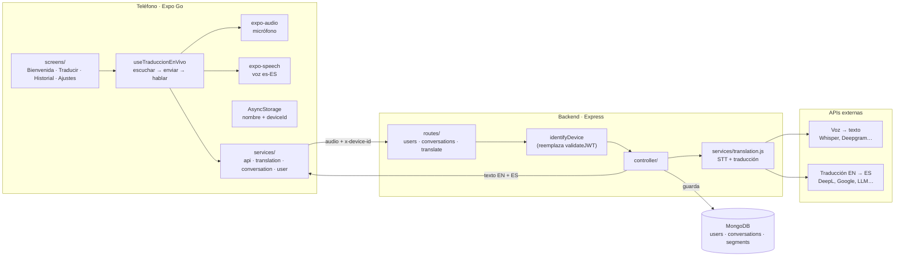
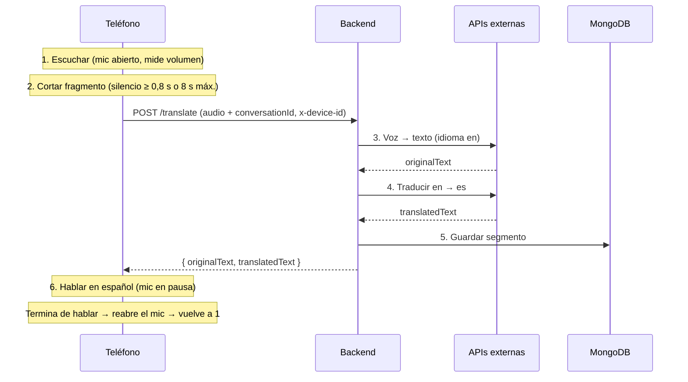

# ARQUITECTURA.md — TraduFly

> **Estado:** propuesta v1, pendiente de aprobación del equipo. Basada en el commit `c67592c`.
> Complementa a `AGENTS.md`: las reglas de trabajo siguen allí; aquí está **qué** se va a construir.
> Versión visual: https://claude.ai/artifact/KUNhhJCNBDCdHPZmpdmauo (privada; pedir acceso a Rafael).

## Qué es TraduFly

App móvil que escucha inglés y lo dice en español, en voz alta, mientras la conversación sigue. Guarda cada conversación a nombre de quien usa el teléfono.

- **Sin inicio de sesión.** En el primer arranque se pregunta el nombre; el usuario queda identificado por el dispositivo.
- **Idiomas fijos por ahora:** oye inglés (`en`), habla español (`es`). La arquitectura ya guarda los idiomas como datos para poder añadir más.
- **Historial:** cada sesión de escucha es una conversación; cada frase traducida es un segmento.

```
voz en inglés → texto EN → texto ES → voz en español  (+ se guarda en el historial)
```

---

## 1. Estado actual del repo

| Estado | Hallazgo |
|---|---|
| 🔴 Bloquea | `backend/src/app.js` importa `./routes/products.js`, que no existe. El servidor falla al arrancar. |
| 🔴 Bloquea | `config/db.js` lee `DB_URI`, pero `AGENTS.md` documenta `MONGODB_URI`. Con el `.env` del ejemplo, Mongo recibe `undefined`. |
| 🟠 Corregir | `dbConnect()` no devuelve la promesa de `mongoose.connect`: el `await` de `index.js` no espera y un fallo de conexión no llega al `catch`. El puerto está fijo en 5000 e ignora `PORT`. |
| 🟠 Corregir | `GET /get-users` devuelve los hashes de contraseña (la ruta desaparece con TraduFly). |
| 🟢 Se reutiliza | El modelo `Chat` (`originalText`, `translatedText`, idiomas, `conversationId`) ya es casi un segmento. Sus controladores validan bien y filtran por usuario. |
| 🟢 Se reutiliza | `frontend/src/services/api.js` con `EXPO_PUBLIC_API_URL`, CORS abierto y la estructura de carpetas de `AGENTS.md`. |
| 🔵 Cambia | Login, contraseñas y JWT sobran. `app.json` todavía se llama `frontend`. |

---

## 2. Vista general del sistema

El teléfono graba y reproduce; el backend convierte voz en texto, traduce, guarda y responde. **Las claves de las APIs externas viven solo en el servidor.**



Todo lo que usa el teléfono (`expo-audio`, `expo-speech`, AsyncStorage, `expo-crypto`) funciona en **Expo Go**, sin development build.

---

## 3. El ciclo en vivo

La app trabaja **por fragmentos**: graba hasta detectar una pausa, manda ese pedazo, reproduce la traducción y vuelve a escuchar. Se repite hasta que el usuario pulsa **Detener**.



- **Latencia esperada:** 2–3 s por frase, desde que la otra persona hace una pausa.
- **Máquina de estados del hook `useTraduccionEnVivo`:** `idle → listening → sending → speaking → listening` (vuelve a `idle` con Detener).
- **El micrófono se cierra durante el paso 6.** Si quedara abierto, la app oiría su propia voz en español y la mandaría a traducir como si fuera inglés.

---

## 4. Identidad sin inicio de sesión

| Hoy | TraduFly |
|---|---|
| `POST /create-users` con email y contraseña | Primer arranque: pantalla **Bienvenida** pregunta «¿Cómo te llamas?» |
| `POST /login` devuelve un JWT de 1 hora | La app genera un UUID con `expo-crypto` (`utils/deviceId.js`) |
| Cada petición manda `x-token` | `POST /users` con `{ name, deviceId }`; se guarda también en AsyncStorage |
| `validateJWT` saca el email del token | Cada petición manda `x-device-id`; `identifyDevice` busca al usuario y lo pone en `req.user` |
| Al caducar, volver a iniciar sesión | Los siguientes arranques van directo a Traducir: «Hola, Ana» |

El header `x-device-id` se añade con un interceptor en `frontend/src/services/api.js`.

---

## 5. Pantallas (frontend)

Navegación: `AppNavigator` decide según `UserContext`. Sin usuario → **Bienvenida**. Con usuario → tres pestañas (bottom tabs) + stack para el detalle.

```
Primer arranque ──► BienvenidaScreen ──► (crea usuario)
                                             │
                  ┌──────────────────────────┴──────────────┐
                  ▼                    ▼                    ▼
          TraducirScreen       HistorialScreen        AjustesScreen
                                       │
                                       ▼
                              ConversacionScreen
```

| Pantalla | Contenido |
|---|---|
| `BienvenidaScreen` | Solo en el primer arranque. Campo «¿Cómo te llamas?» + botón **Empezar**. Crea el usuario. |
| `TraducirScreen` | Saludo «Hola, {nombre}», chip `EN → ES`, burbujas original/traducción en vivo, estado («escuchando…») y un botón grande **Escuchar / Detener** (`MicButton`). |
| `HistorialScreen` | Conversaciones del usuario, la más reciente arriba: fecha/hora + número de frases. |
| `ConversacionScreen` | Pares original / traducción (`SegmentBubble`). ▶ vuelve a decir la frase. Opción **Borrar conversación**. |
| `AjustesScreen` | Cambiar nombre. Idiomas visibles pero bloqueados (Oigo: Inglés · Hablo: Español). Velocidad de voz. |

---

## 6. Estructura de archivos

Se mantienen las carpetas de `AGENTS.md`. **La única carpeta nueva es `backend/src/services/`** y, según la regla 2 de `AGENTS.md`, necesita el visto bueno del equipo antes de crearla.

Leyenda: `+` nuevo · `~` cambia · `−` se retira

```
backend/src/
├── ~ app.js                 # quitar import de products
├── ~ index.js               # usar process.env.PORT
├── config/
│   ├── ~ db.js              # MONGODB_URI y devolver la promesa
│   └── ~ middleware.js      # identifyDevice
├── controller/
│   ├── ~ users.js           # registro por deviceId, /me
│   ├── + conversations.js
│   ├── ~ chats.js → segments
│   └── + translate.js
├── models/
│   ├── ~ users.js           # name, deviceId, idiomas
│   ├── + conversations.js
│   └── ~ chats.js           # + userId (segments)
├── routes/
│   ├── ~ users.js
│   ├── + conversations.js
│   ├── − chats.js
│   └── + translate.js
└── + services/
    └── + translation.js     # STT + traducción

frontend/
├── ~ App.js                 # Provider + Navigator (sin lógica de negocio)
├── ~ app.json               # name: TraduFly, permiso de micrófono
└── src/
    ├── screens/
    │   ├── + index.js
    │   ├── + BienvenidaScreen.js
    │   ├── + TraducirScreen.js
    │   ├── + HistorialScreen.js
    │   ├── + ConversacionScreen.js
    │   ├── + AjustesScreen.js
    │   └── − HomeScreen.js
    ├── navigation/
    │   └── + AppNavigator.js
    ├── context/
    │   └── + UserContext.js
    ├── hooks/
    │   └── + useTraduccionEnVivo.js
    ├── services/
    │   ├── ~ api.js                 # interceptor x-device-id
    │   ├── + userService.js
    │   ├── + conversationService.js
    │   └── + translationService.js
    ├── components/
    │   ├── + MicButton.js
    │   ├── + SegmentBubble.js
    │   └── + LanguageChip.js
    └── utils/
        ├── + deviceId.js
        └── + languages.js           # SOURCE_LANG = 'en', TARGET_LANG = 'es'
```

---

## 7. Modelo de datos (MongoDB)

Una **conversación** es una sesión entre pulsar Escuchar y pulsar Detener. Cada frase traducida es un **segmento**. Los idiomas se guardan en cada registro aunque hoy siempre sean `en` y `es`, así que añadir idiomas no obliga a migrar datos.

### `users`

| Campo | Tipo / nota |
|---|---|
| `_id` | ObjectId |
| `name` | String, obligatorio («Ana») |
| `deviceId` | String (UUID), único, indexado |
| `sourceLanguage` | String, `'en'` por defecto |
| `targetLanguage` | String, `'es'` por defecto |
| `created` | Date |

### `conversations`

| Campo | Tipo / nota |
|---|---|
| `_id` | ObjectId |
| `userId` | ObjectId → `users._id` |
| `sourceLanguage` | `'en'` |
| `targetLanguage` | `'es'` |
| `startedAt` | Date |
| `endedAt` | Date, al pulsar Detener |
| `segmentCount` | Number, para el Historial |

### `segments` (antes `chat_history`)

| Campo | Tipo / nota |
|---|---|
| `_id` | ObjectId |
| `conversationId` | ObjectId → `conversations._id` |
| `userId` | ObjectId, reemplaza a `user` (email) |
| `originalText` | ya existe |
| `translatedText` | ya existe |
| `sourceLanguage` / `targetLanguage` | ya existen |
| `created` | ya existe |

---

## 8. Rutas del backend

Todas menos `POST /users` exigen el encabezado `x-device-id`.

| Método | Ruta | Qué hace | Respecto a hoy |
|---|---|---|---|
| POST | `/users` | Registra `{ name, deviceId }`. Si el deviceId ya existe, devuelve ese usuario. | Reemplaza `/create-users` |
| GET | `/me` | Perfil del dispositivo actual | Nueva |
| PUT | `/me` | Cambia el nombre (y más adelante los idiomas) | Nueva |
| POST | `/conversations` | Abre una sesión al pulsar Escuchar | Nueva |
| PUT | `/conversations/:id/end` | Cierra la sesión al pulsar Detener | Nueva |
| GET | `/conversations` | Historial del usuario | Reemplaza `/get-chats` |
| GET | `/conversations/:id` | Una conversación con sus segmentos | Reemplaza `/get-chat/:id` |
| DELETE | `/conversations/:id` | Borra la conversación y sus segmentos | Reemplaza `/delete-chat/:id` |
| POST | `/translate` | Recibe audio (multipart) + `conversationId`; devuelve `{ originalText, translatedText }` y guarda el segmento | Nueva; absorbe `/create-chat` |
| — | `/login` | Sin contraseñas | Se retira |
| — | `/change-password` | Sin contraseñas | Se retira |
| — | `/get-users` | Exponía a todos los usuarios | Se retira |
| — | `/delete-user/:id` | Cualquiera podía borrar a cualquiera | Se retira |

Variables de entorno nuevas en `backend/.env` (nombres a confirmar según el proveedor elegido): una clave para voz→texto y otra para traducción. `JWT_SECRET` deja de ser necesaria.

---

## 9. Decisiones y lo que cuestan

**El audio se procesa en el backend.**
Expo Go no trae reconocimiento de voz nativo. Mandar el audio al servidor permite seguir usando Expo Go en clase y mantiene las claves fuera del teléfono.
*Costo:* 2–3 s de retraso por frase. Fase 2: WebSocket con streaming, o `expo-speech-recognition` con development build.

**Escucha y habla por turnos.**
Mientras `expo-speech` dice la traducción, el micrófono está en pausa.
*Costo:* si la otra persona habla mientras la app habla, esa parte se pierde. Con auriculares se podría dejar el mic abierto.

**Identidad por dispositivo.**
Sin email ni contraseña; el deviceId es la llave y viaja en cada petición.
*Costo:* si se desinstala la app, el historial queda huérfano. Aceptable para el proyecto; más adelante se puede añadir «vincular con email».

**Idiomas como datos, no como código.**
Inglés y español viven en `utils/languages.js` y en cada registro; Ajustes ya los muestra bloqueados.
*Costo:* ninguno ahora. Habilitar otro par es cambiar una constante y desbloquear el selector; el backend ya recibe los idiomas como parámetro.

---

## 10. Reparto sugerido por rama

Tres bloques que se tocan poco entre sí. Primero se acuerdan los modelos y rutas de este documento; después cada quien trabaja en su rama.

| Rama | Bloque | Tareas |
|---|---|---|
| `fer` | Usuario e identidad | Modelo `users`, `identifyDevice`, `/users` y `/me`. `UserContext`, `deviceId`, `BienvenidaScreen`, `AjustesScreen`. `AppNavigator` con la lógica de primer arranque. |
| `molina` | Historial | Modelos `conversations` y `segments`, rutas `/conversations`. `HistorialScreen`, `ConversacionScreen`, `SegmentBubble`. Arreglos de arranque: `products.js`, `MONGODB_URI`, `PORT`. |
| `rafael` | Traducción en vivo | `/translate`, multer y `services/translation.js`. `useTraduccionEnVivo`, `MicButton`, `TraducirScreen`. Grabación por fragmentos y voz con `expo-speech`. |

### Dependencias a instalar

```bash
# frontend (siempre con expo install, ver AGENTS.md)
npx expo install expo-audio expo-speech expo-crypto @react-native-async-storage/async-storage
npx expo install @react-navigation/native @react-navigation/bottom-tabs @react-navigation/native-stack react-native-screens react-native-safe-area-context

# backend
npm install multer
```

---

## Pendiente de decidir

- [ ] Aprobar la carpeta nueva `backend/src/services/`.
- [ ] Elegir proveedor de voz→texto y de traducción.
- [ ] Confirmar la interpretación de «distinguir al usuario»: cada conversación pertenece a quien usa el teléfono (no se distingue por voz quién habla).
